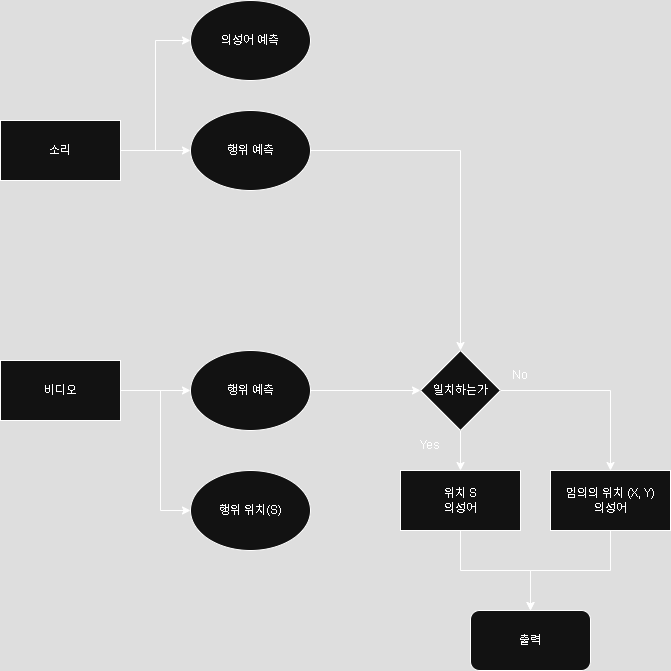

# 1. 계획 실현을 위한 플랜   
   
팀프로젝트를 이어가기에 앞서서 대면, 비대면 회의 일정 계획을 잡았다.   
매주 2번 각자의 성과를 간결하게 브리핑하고 합쳐서 다음 과제를 해결하는 식의 상향식 방법을 채택했다.   

# 2. 파이프 라인 그리기

모델을 정하기에 앞서 앞에서 설정한 과제를 어떻게 이뤄낼 것인지를를 간단한 파이프 라인을 그렸다.   

여러 가지들을 후보군으로 놓고 겨루어봤을 때 실현 난이도에 대해 이 방안이 가장 현실적이라고 느꼈다. 안은 세 개 있었다.

1. 객체 탐지-> 오디오 예측, 오디오-> 의성어 매핑, 의성어-> 객체 bbox에 표시
2. 객체 탐지-> 객체 bbox, 오디오-> 의성어 매핑, 의성어-> 객체 bbox에 표시
3. 객체 탐지-> 객체 bbox, 오디오-> 의성어 예예측, 의성어-> 객체 bbox에 표시

*1안*은 객체를 탐지하고 객체에 대한 image to sound로 오디오를 예측한다. 그 오디오를 기반으로 올바른 매핑을 진행해 원하는 위치에 의성어를 표시한다.

*2안*은 객체 탐지로 위치를 알아내고, 오디오는 어떤 물체인지, 어떤 의성어인지를 예측한다. 이후 객체와 물체의 라벨링이 일치할 때 해당 bbox에 의성어를 표시한다.

*3안*은 2안과 비슷하지만 중간에 자연어처리 모델을 학습시키는 과정이 있다. 소리의 높낮이, 종류 같은 정보를 학습시킨 후 이에 대한 의성어를 생성하는것이다.

개인적인 목표로는 3안을 실현시키고 싶었지만, NLP는 배우지도 않았거니와 그 데이터셋을 만드는 방법도 모르기에 1달에서 2달정도 기한의 프로젝트 과제로써는 학습이 부족하다고 느꼈다.

따라서 2안을 선택했다. 2안의 경우 예측하는 것이 객체의 bbox, 소리에 대한 라벨링과 의성어뿐이기에 파이프 라인도 상당히 간단하고, 두 라벨을 일치시킨 데이터셋을 AI-HUB에서 찾았기 때문이다.

# 3. 데이터 분석

**[AI-HUB 이미지 사운드 매칭 데이터셋][imgsdmatlink]** 은 이름처럼 사운드-이미지 매칭 데이터이다. 이들이 학습한 AI 모델은 이미지를 기반으로 소리를 예측하거나, 소리를 기반으로 이미지를 예측하는 모델을 구축하였다.

AVE_dataset과 다르게 한국식으로 훨씬 많은 라벨링을 포함하고, 사운드와 bbox 형태의 라벨링을 지원하므로 고르게 되었다.   

10개 정도(urbansound, soundset, ave...)의 데이터 중 전처리 할 부분이이 적었다.

## * 데이터 선택   

모든 데이터를 다운로드 받아서 학습을 시키는 것은 저장공간적으로나 시간 자원적으로나 불가능한 일이다.   
때문에 여러가지 이미지-사운드 쌍 중에 9가지의 라벨을 골라서 프로젝트를 진행하기로 논의하였다.   
작은 모델을 성공시켜 그 가능성과 사업적 가치를 단편적으로라도 설명해보자는 취지이다.   

선택한 9가지 클래스는 다음과 같다.
*[굽기, 튀기기, 냉장고 사용, 썰기, 드라이어 사용, 압력밥솥 사용, 믹서기 사용, 전자레인지 사용, 끓이기]*   
이 중 굽기, 튀기기, 썰기, 끓이기, 믹서기의 경우 여러 재료(당근, 양파, 고기 등)의 경우로 하위 분류가 되어있어 다른 클래스에 비해 약 3배 정도 데이터량이 더 많다.   

따라서 차후 데이터 불균형 문제로 이어질 것이다. 모델은 적은 데이터의 클래스 예측에 실패하는 경우가 더 많아질 것이다.   

이는 우리가 실시간으로 화면에 의성어를 라벨링하는 것을 목표로 하며, 이를 위해서는 모델이 경량이 되어 해당 클래스들을 전부 담을 수 있을 정도의 넓이와 깊이가 나오지 않을 것이기 떄문이다.   

    해결하기 위해서 어떤 방식을 선택 할 지는 구현 후 생각한다.

## 4. 데이터셋의 문제점

### + 비슷한 이미지를 여러 개 포함시켜놓았다.   
아무래도 소리의 어노테이션 구간마다 사진을 하나씩 놓아 모델의 시간적 측면을 살리려고 한 것 같다. 이로 인해 육안으로 보기에도 똑같은 사진인데(구도 변화도 적음) 중복된듯 들어가있는 사진이 많다.

### + 파일 경로가 한글이다.
cv2로 작업을 진행하려고 했던(또는 YOLO) 초반 기획에서 조금 귀찮아졌다. 작업을 하면서 한글 경로인 탓에 문제가 발생할 확률이 100%다.

### + 사운드 데이터가 적다.
해상도가 매우 좋은 방면 소리 자체는 60개 밖에 안 된다. 또, 전기압력밥솥의 경우 소리가 하나로 정의 내리기 어려운 다양한 소리가 담겨있다.   
닫는 소리, 취사 소리, 김 나오는 소리, 취사 완료 안내 음성 소리 등 여러 소리를 적은 데이터량이면서 동시에 담고 있어 학습이 제대로 되지 않을 것이라는 에측이 가능하다.   

[imgsdmatlink]: https://www.aihub.or.kr/aihubdata/data/view.do?currMenu=115&topMenu=100&aihubDataSe=data&dataSetSn=71602